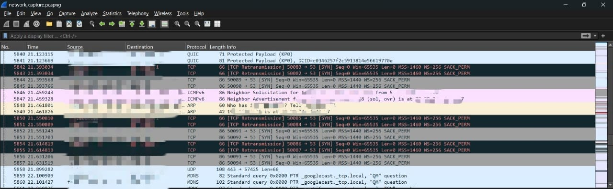
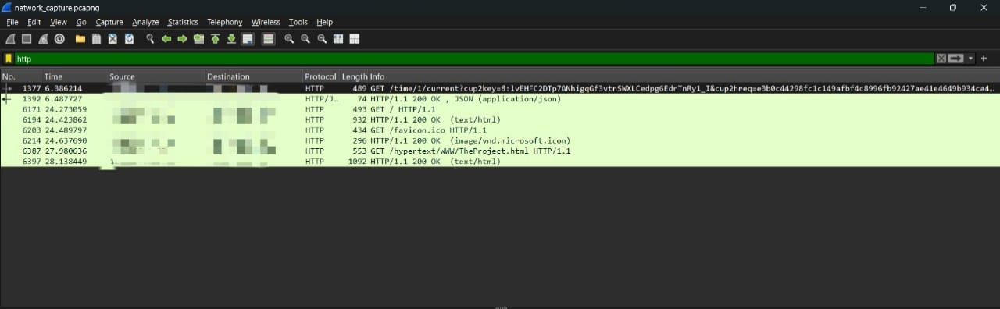

# Network Traffic Analysis with Wireshark

## Project Objective
The objective of this project is to capture live network packets using Wireshark and to identify and analyze basic protocols and traffic types to develop hands-on packet analysis skills.

## Tool Used
* **Wireshark:** A free and open-source packet analyzer used for network troubleshooting and analysis.

## Process Overview
1.  Wireshark was installed and configured to capture live traffic on the primary network interface.
2.  Basic network traffic was generated by pinging a remote server and Browse an HTTP website.
3.  The packet capture was stopped after approximately one minute of activity.
4.  Display filters were used to isolate and inspect specific protocols within the captured traffic.
5.  The final capture was saved locally as a `.pcapng` file for analysis. For security and privacy reasons, the raw capture file is not included in this public repository.

## Summary of Protocols Identified
During the packet capture, several different protocols were identified. Below is a summary of three key protocols that were analyzed:

* **DNS (Domain Name System):** DNS query and response packets were observed. These packets are responsible for translating human-readable domain names (e.g., `google.com`) into machine-readable IP addresses. The capture shows the request for the IP address and the DNS server's reply.

* **TCP (Transmission Control Protocol):** A large portion of the captured traffic consisted of TCP packets. This protocol establishes a reliable connection using a three-way handshake (`SYN`, `SYN-ACK`, `ACK`) before data is transmitted, ensuring all packets are received correctly. This was primarily seen in the connection to the web server.

* **HTTP (Hypertext Transfer Protocol):** Because an unencrypted website was visited, it was possible to filter for and inspect the raw HTTP traffic. This allowed for the observation of the `GET` request sent from the client to the server to fetch the webpage content.

## Evidence: Screenshots
The screenshots below document the live capture and analysis process in Wireshark. Sensitive information such as public IP addresses has been redacted.

### Wireshark Capture Dashboard

### Filtering for DNS Traffic

---
## 👤 Author

* **Vritti Garg**
* [LinkedIn](https://www.linkedin.com/in/vritti-garg-682667284/)
